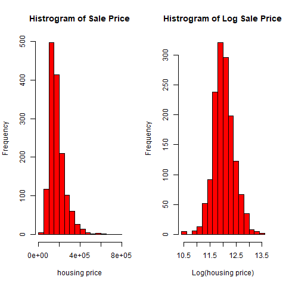
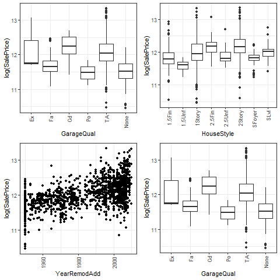
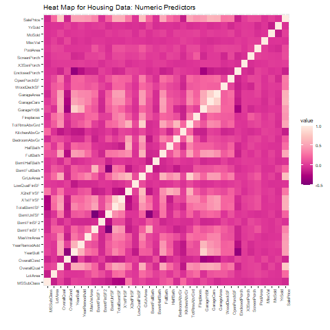

# Ames Housing
This repo contains the code used for the Kaggle competition on the Ames Housing dataset. The housting dataset is high dimensional. We also cover how to impute missing values, apply feature engineering, and model blending. In the end, we combine a prediction that uses Support Vector Machines (SVM regression), Random Forests, Gradient Boosting, and a Elastic Net regressor. 

Image and Data Citation: https://www.kaggle.com/c/house-prices-advanced-regression-techniques

We will show for a relatively large dataset, it is better and faster to work with a log transformed sale price, rather than the original saleprice. In the end, we will use the technique of model averaging/blending to combine models. This results in predictions that obtain a score in the top 15% of submission via Kaggle. 

Of course, we want to get a baseline idea of how each predictor impacts sale price

We will also examine the relationships between predictors themselves.

